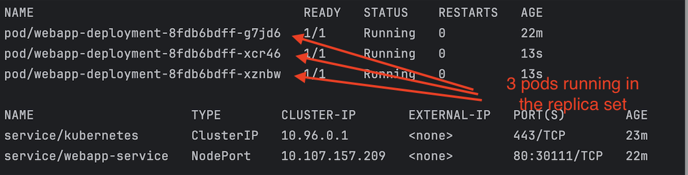

# Single WebApp Application

For our example, we would like to start a very simple service and use the image `traefik/whoami`, which is a simple web server displaying information about the server and the caller when the endpoint is called.

Upon inspecting the `docker-compose.yaml` file, you will notice that the app will listen on port 1212, and you can access it using http://localhost:1212.

Let's initiate the app with the following command:

```bash
docker compose up
```

If everything starts properly, you should be able to access the URL http://localhost:1212 and receive a response similar to the following:


Great!

Now, let's deploy this application to our local Kubernetes cluster.

## Create the Configuration File

Now, let's create the configuration file for our webapp service that we intend to deploy into the Kubernetes cluster.

The configuration consists of two parts: Deployment and Service.


The configuration file is written in our case in YAML and defines a Kubernetes Deployment and Service for a web application using the image `traefik/whoami:v1.10.1`.

Let's break down the components of the configuration file:

### Deployment Section:
- `apiVersion: apps/v1`: Specifies the API version for the Deployment object.
- `kind: Deployment`: Indicates that this YAML document defines a Deployment resource.
- `metadata`: Contains metadata about the Deployment, such as its name and labels.
    - `name: webapp-deployment`: Specifies the name of the Deployment.
    - `labels`: Assigns labels to the Deployment.
- `spec`: Defines the desired state for the Deployment.
    - `replicas: 1`: Specifies that the Deployment should maintain 1 replica (instance) of the application.
    - `selector`: Defines how the Deployment selects which Pods to manage.
        - `matchLabels`: Specifies that Pods managed by this Deployment should have the label `app: webapp`.
    - `template`: Specifies the Pod template for the Deployment.
        - `metadata`: Contains metadata for the Pods created by the Deployment.
            - `labels`: Assigns labels to the Pods.
        - `spec`: Defines the specification for the Pods.
            - `containers`: Specifies the containers to run in the Pods.
                - `name: webapp`: Specifies the name of the container.
                - `image: traefik/whoami:v1.10.1`: Specifies the Docker image to use for the container.
                - `ports`: Defines the ports to expose on the container.
                    - `containerPort: 80`: Specifies that the container listens on port 80.

### Service Section:
- `apiVersion: v1`: Specifies the API version for the Service object.
- `kind: Service`: Indicates that this YAML document defines a Service resource.
- `metadata`: Contains metadata about the Service, such as its name.
    - `name: webapp-service`: Specifies the name of the Service.
- `spec`: Defines the desired state for the Service.
    - `type: NodePort`: Specifies that the Service should be exposed externally using a NodePort.
    - `selector`: Specifies which Pods the Service should route traffic to based on their labels.
        - `app: webapp`: Selects Pods with the label `app: webapp`.
    - `ports`: Defines the ports that the Service should expose.
        - `protocol: TCP`: Specifies the protocol used for the ports.
        - `port: 80`: Specifies the port on which the Service should listen within the cluster.
        - `targetPort: 80`: Specifies the port on the Pods to which traffic should be forwarded.
        - `nodePort: 30111`: Specifies the port on which the Service should be accessible externally on each node in the cluster.

## Deploy the App

To deploy the app, you need to execute a simple command and provide the configuration file you want to deploy into the cluster:

```bash
kubectl apply -f webapp.yaml
```

You should receive output similar to this:

```bash 
deployment.apps/webapp-deployment created
service/webapp-service created
```

Note: If you make changes to your configuration and wish to deploy them again, simply execute the same command, and everything will be updated automatically in the cluster.

## Check the App in the Cluster

Now, we can check if our webapp service is available in the cluster by typing:

```bash
kubectl get all
```

You should receive output similar to this:


## Find the IP of the App

To be able to access the app, we have two options.

#### 1. Find the IP of the cluster and add the port from the `nodePort` property

Type the command:

```bash 
minikube ip
```

You should receive the IP address of the cluster. For example:

```bash 
192.168.49.2
```

And your app should be accessible at:

```bash 
192.168.49.2:30111
```

Note: On MacOS running Minikube with the Docker driver, there are issues with "Minikube IP not accessible". If you encounter the same issues, use option 2 below.

#### 2. Creating a Proxy and Displaying the URL

Type the command `minikube service <metadata.name> --url`. For example:

```bash 
minikube service webapp-service --url
```

You will receive output like this:

```bash
http://127.0.0.1:52519
❗  Because you are using a Docker driver on darwin, the terminal needs to be open to run it.
```

Now, you can access your app with this generated URL: http://127.0.0.1:52519

If everything is fine, you should receive the expected result.


Now, let's start the Kubernetes Dashboard and check there. Type the command:

```bash 
minikube dashboard
```

If everything is fine, you should be able to see the dashboard by calling the generated URL in the console.

In my case, it is:

http://127.0.0.1:52577/api/v1/namespaces/kubernetes-dashboard/services/http:kubernetes-dashboard:/proxy/#/workloads?namespace=default


Everything looks fine, and our app is up and running.

## Add More Replicas

Now, let's imagine we want to have more replicas for our application.

Change the configuration and set 3 replicas:

```bash 
spec:
  replicas: 3
```

Deploy the app:

```bash 
kubectl apply -f webapp.yaml
```

Now, when you type:

```bash 
kubectl get all
```

You should see the 3 pods running in the same replica set:



Checking now in the Kubernetes Dashboard, you will see that we have 3 pods running in the same replica set.


When you open the app again through the auto-generated URL above (URL: http://127.0.0.1:52519/), after a few refreshes, you will notice that the `Hostname` changes as one of the available pods is requested. This is because we have an internal load balancer, which is routing the request to the available pods in a round-robin manner.


Works perfectly!

## Remove the App

If we want to delete our webapp from our cluster, then we have to type:

```bash
kubectl delete -f webapp.yaml
```

You will receive a message like this:

```bash
deployment.apps "webapp-deployment" deleted
service "webapp-service" deleted
```

By checking the cluster again with:

```bash
kubectl get all
```

You will see that we no longer have any application in the cluster:

```bash
NAME                 TYPE        CLUSTER-IP   EXTERNAL-IP   PORT(S)   AGE
service/kubernetes   ClusterIP   10.96.0.1    <none>        443/TCP   39m
```

Happy coding!
