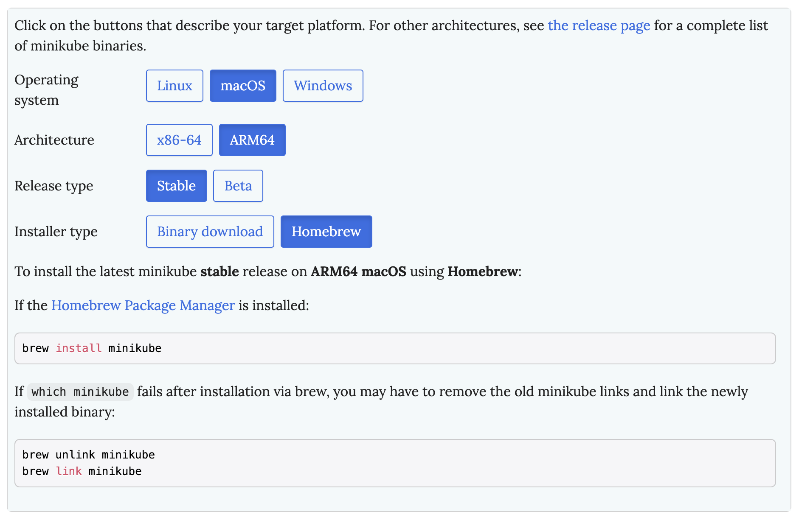
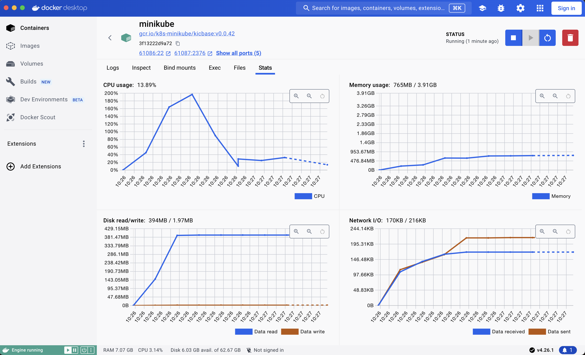

# Kubernetes
Kubernetes is a powerful open-source container orchestration platform that automates the deployment, scaling, and management of containerized applications. It simplifies the complexities of managing containerized workloads and enables efficient scaling across diverse environments. For more information and in-depth resources, visit the official Kubernetes website: [Kubernetes Official Site](https://kubernetes.io/).

## Kubernetes on a Local machine

**Minikube** is a local Kubernetes platform designed to facilitate learning and development for Kubernetes. 
It simplifies the process by requiring only Docker (or a compatible container) or a virtual machine environment.

To get started, visit the installation page at https://minikube.sigs.k8s.io/docs/start/ and explore the documentation.

I am currently utilizing Docker as a virtual machine environment on my local machine.



Due to Docker, I am initiating Minikube using the following command:

```
minikube start --driver=docker
```

After a short period of time and a successful Minikube startup, you will also be able to observe the container running within your local Docker environment.



Let's make note of some useful commands:

* [minikube status](https://minikube.sigs.k8s.io/docs/commands/status/) - Gets the status of a local Kubernetes cluster
* [minikube ip](https://minikube.sigs.k8s.io/docs/commands/ip/) - Retrieves the IP address of the specified node
* [minikube dashboard](https://minikube.sigs.k8s.io/docs/commands/dashboard/) - Access the Kubernetes dashboard running within the minikube cluster
* [minikube logs](https://minikube.sigs.k8s.io/docs/commands/logs/) - displays the logs

You can find a comprehensive list of all the commands here: https://minikube.sigs.k8s.io/docs/commands/

## Training Examples

Let's take a look at some real examples:

 [Single Web Application](01-webapp-example/README.md)

Happy coding!
